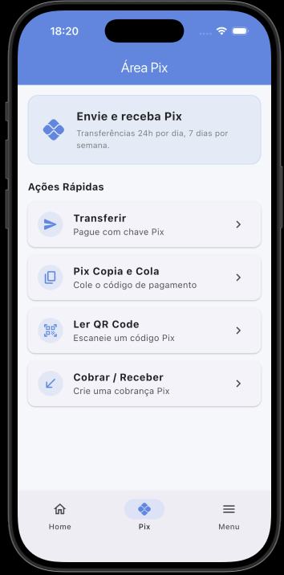
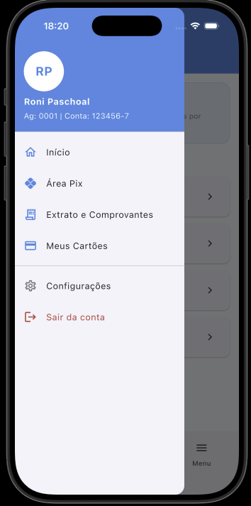

# RP Pay

Fictional payments app built as a **personal study of Flutter and Artificial Intelligence**, focused on applying development best practices, code organization, and building an experience close to a real financial app.

> 🚧 **Project in development**
>
> This project is being used as a lab for studying Flutter, architecture, state management, and the use of AI throughout the development process.

## 📱 About the project

The app simulates the experience of a payments app, presenting financial information and features common to this type of product.

Currently, the project includes:

* Splash Screen
* Home
* Available balance view
* Quick actions
* Card information
* Current invoice amount
* Transaction history
* Pix area
* Side menu (Drawer)

New features and improvements will be added as the study evolves.

## 🖼️ Screenshots

### Home


### Pix



### Drawer



## 🏗️ Architecture

The project uses **MVVM (Model-View-ViewModel)** as its architectural reference, aiming to keep responsibilities well defined between presentation, state, and application rules.

Some **SOLID** principles are also applied, mainly with the goal of keeping the code organized, decoupled, and easier to evolve.

### SOLID principles

How each principle is applied in the project's MVVM (Feature-First) + Cubit architecture:

* **S — Single Responsibility**: each layer has a single responsibility (`views/` only builds UI, `cubits/` only manages state, `data/repositories/` only accesses data, `data/models/` only structures data).
* **O — Open/Closed**: states (`HomeState`, `PixState`, etc.) are closed for contract changes but open for extension via subclasses. New features can be added without modifying the existing ones (e.g. `home/` or `pix/`) — the exception is the navigation module (`main_navigation_view.dart` and `custom_drawer.dart`), which, being the app's composition point, requires a small, targeted change to register the new feature.
* **L — Liskov Substitution**: any repository implementation (e.g. `HomeRepositoryImpl` or a future `HomeMockRepository`) can substitute the abstraction without breaking the corresponding `Cubit`.
* **I — Interface Segregation**: repositories are segregated per feature (`HomeRepository.fetchItems()`, `PixRepository.getPixActions()`), avoiding a monolithic repository with methods a feature doesn't use.
* **D — Dependency Inversion**: Cubits depend on the repository's abstraction (injected via constructor), never on the concrete implementation, which makes it easier to swap the data source and write tests with mocks.

### State management

State management is handled using:

* **BLoC**
* **Cubit**

This choice separates state and events from the presentation layer, keeping widgets more focused on building the interface.

## 📂 Project structure

The project uses a **Feature-First** organization, separating the app's functionality into independent modules.

```text
lib/
├── core/                                      # 🌐 Global, shared layer
│   ├── constants/
│   │   └── app_colors.dart                    # Centralized color palette
│   │
│   ├── theme/
│   │   └── app_theme.dart                     # ThemeData configuration (Material 3)
│   │
│   └── widgets/
│       ├── custom_button.dart                 # Reusable button with loading state
│       └── custom_drawer.dart                 # Navigable side menu
│
├── features/                                  # 📦 Modules organized by feature
│   │
│   ├── splash/                                # 🚀 Splash Screen
│   │   ├── cubits/
│   │   │   ├── splash_cubit.dart              # Startup flow management
│   │   │   └── splash_state.dart              # Splash states
│   │   │
│   │   └── views/
│   │       └── splash_view.dart                # Splash interface
│   │
│   ├── navigation/                            # 🧭 Main navigation
│   │   ├── cubits/
│   │   │   ├── navigation_cubit.dart          # Active tab management
│   │   │   └── navigation_state.dart          # Navigation state
│   │   │
│   │   └── views/
│   │       └── main_navigation_view.dart       # Main navigation
│   │
│   ├── home/                                  # 🏠 Dashboard / Home
│   │   ├── cubits/
│   │   │   ├── home_cubit.dart                # Home state and rules
│   │   │   └── home_state.dart                # Home states
│   │   │
│   │   ├── data/
│   │   │   ├── models/
│   │   │   │   └── home_data_model.dart       # Home data model
│   │   │   │
│   │   │   └── repositories/
│   │   │       └── home_repository.dart        # Data abstraction and implementation
│   │   │
│   │   └── views/
│   │       └── home_view.dart                  # Home interface
│   │
│   └── pix/                                   # ⚡ Pix area
│       ├── cubits/
│       │   ├── pix_cubit.dart                 # Pix area state and rules
│       │   └── pix_state.dart                 # Pix states
│       │
│       ├── data/
│       │   ├── models/
│       │   │   └── pix_action_model.dart       # Pix actions model
│       │   │
│       │   └── repositories/
│       │       └── pix_repository.dart         # Data abstraction and implementation
│       │
│       └── views/
│           └── pix_view.dart                   # Pix actions interface
│
└── main.dart                                  # 🎬 Application entry point
```

### Layer organization

The structure follows a **Feature-First** approach, where each feature has its own components and rules.

* **`core/`** — holds resources shared across different features, such as theme, constants, and reusable widgets.
* **`features/`** — groups the app's features, keeping each domain isolated and easier to evolve.
* **`cubits/`** — holds state management and presentation-related logic.
* **`views/`** — contains the interfaces responsible for presenting data and handling user interaction.
* **`data/models/`** — contains the models used to represent each feature's data.
* **`data/repositories/`** — holds the data access abstraction, allowing the data source to be swapped later without directly impacting the presentation layer.

This organization aims to favor **separation of concerns, low coupling, and ease of maintenance**, applying **SOLID** principles whenever it makes sense for the application's context.

## 🛠️ Technologies

| Technology       | Usage                       |
| ---------------- | ---------------------------- |
| Flutter          | Main framework               |
| Dart             | Language                     |
| BLoC / Cubit     | State management             |
| MVVM             | Architecture                 |
| SOLID            | Design principles            |
| Gemini 3.6 Flash | Development support with AI  |
| Claude Code      | Development support with AI  |
| Dart/Flutter MCP | Claude Code plugin (`dart-flutter`) providing analysis, hot reload/restart, LSP, and runtime error inspection tools |

**Flutter:** `3.44`

> TODO: add other libraries and dependencies used in the project.

## 🤖 Artificial Intelligence

**Artificial Intelligence is part of this project's development process.**

**Gemini 3.6 Flash** and **Claude Code** were used as support tools during development, mainly as a study resource, for exploring alternatives, and assisting with implementation.

The goal is not just to use AI to generate code, but to explore how AI tools can be part of the software development process while maintaining technical ownership of the decisions and code produced.

> TODO: document examples of AI usage and decisions made during development.

## 🚀 Getting started

### Prerequisites

* Flutter installed
* Dart SDK compatible with the Flutter version used
* Android Studio or Xcode, if you want to run on mobile devices

### Running the project

Clone the repository:

```bash
git clone https://github.com/ronipaschoal/rppay.git
```

Go to the directory:

```bash
cd rppay
```

Install dependencies:

```bash
flutter pub get
```

Run the app:

```bash
flutter run
```

### Dart/Flutter MCP (optional, for Claude Code)

This project can be assisted by the Dart/Flutter MCP server via the `dart-flutter` Claude Code plugin, which provides tools for analysis, hot reload/restart, LSP, pub, and runtime error inspection. It is installed at the user scope (not committed to this repo). To install it:

```bash
claude plugin install dart-flutter@dart-flutter
```

Check it's connected with:

```bash
claude mcp list
```

## 🧪 Tests

> TODO: add unit tests, widget tests, and/or integration tests.

## 🔄 CI/CD

> TODO: set up and document the CI/CD pipeline.

## 🌐 API and data

The project currently runs **locally**, with no dependency on external services.

> TODO: define the API used and the backend communication strategy.

> TODO: define a local persistence/cache strategy.

## 💡 Technical decisions

> TODO: document the main architectural and technical decisions made during development.

Some points that may be documented in the future:

* Reasons for using MVVM
* Choice of BLoC/Cubit
* Feature organization
* Component reuse strategy
* Separation of concerns
* State handling
* Testing strategy

## 🗺️ Roadmap

* [x] Define and document folder structure
* [ ] Create requirements documentation
* [ ] Implement the data layer
* [ ] Define API
* [ ] Implement local persistence
* [ ] Add unit tests
* [ ] Add widget tests
* [ ] Add integration tests
* [ ] Set up CI/CD
* [ ] Document architectural decisions
* [ ] Add new features
* [ ] Improve test coverage
* [ ] Document AI usage

## 📚 Study goal

This project aims to explore, in practice:

* Application development with Flutter
* MVVM architecture
* State management with BLoC/Cubit
* SOLID principles
* Code organization and scalability
* Interface development for financial applications
* Use of Artificial Intelligence in software development
* Incremental evolution of a Flutter application

## 📌 Status

**In development 🚧**

This project is a personal lab and may undergo architecture, implementation, and feature changes as new concepts are studied and applied.

---

## 👨‍💻 Author

**Roni Paschoal**

Software Developer with experience building applications using Flutter and other software development technologies.

[GitHub](https://github.com/ronipaschoal)

[LinkedIn](https://www.linkedin.com/in/roni-paschoal/)
